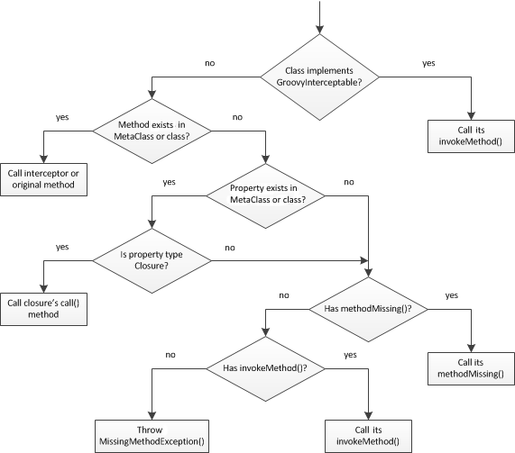

# groovy258-category-mixin-runtime-metaprogramming-workshop

_Reference_: https://en.wikipedia.org/wiki/Metaclass
_Reference_: http://docs.groovy-lang.org/latest/html/api/groovy/lang/Category.html
_Reference_: https://groovy-lang.org/metaprogramming.html
_Reference_: https://groovy-lang.org/metaprogramming.html#categories
_Reference_: https://groovy-lang.org/metaprogramming.html#xform-Category
_Reference_: http://docs.groovy-lang.org/next/html/documentation/#_differences_with_mixins
_Reference_: http://docs.groovy-lang.org/latest/html/api/groovy/lang/ExpandoMetaClass.html

# runtime metaprogramming
* allows altering the class model and the behavior of a program at runtime
## internals
* for every method invocation from groovy code, Groovy will find the `MetaClass` for the given object 
and delegate the method resolution to the metaclass via `MetaClass#invokeMethod` which should not be confused 
with `GroovyObject#invokeMethod` which happens to be a method that the metaclass may eventually call
* `MetaClass`, `MetaClassImpl` defines the behaviour of any given Groovy or Java class
    ```
    // Goal = to be able to simply write "1.m + 20.cm - 8.mm"
    Number.metaClass {
        getMm = { delegate          }
        getCm = { delegate *  10.mm }
        getM  = { delegate * 100.cm }
    }
    
    assert (1.m + 20.cm - 8.mm) == 1.192.m
    ```
    * just as an ordinary class defines the behavior of certain objects, a metaclass defines the behavior of certain 
        classes and their instances
    * all method calls from Groovy code go through the meta class
    * `getMethods()`
    * `getProperty​(Class sender, Object receiver, String property, boolean isCallToSuper, boolean fromInsideClass)`
    * `invokeMethod​(Class sender, Object receiver, String methodName, Object[] arguments, boolean isCallToSuper, boolean fromInsideClass)`
    * The MetaClass interface defines two parts
        * client API, which is defined via the extend MetaObjectProtocol interface 
        * and the contract with the Groovy runtime system
* `ExpandoMetaClass` is a `MetaClass` that behaves like an `Expando` - it allows for dynamically adding or changing 
methods, constructors, properties and even static methods by using a neat closure syntax
* In Groovy we work with three kinds of objects
    * POJO - a regular Java object
    * POGO - a Groovy object whose class is written in Groovy
        * extends `java.lang.Object`
        * implements `groovy.lang.GroovyObject`
            * through `GroovyObject` we have access to `MetaClass`
            * field metaClass: MetaClass
            * field property: Object
    * Groovy Interceptor - a Groovy object
        ```
        Live Demo
        class Example {
           static void main(String[] args) {
              Student mst = new Student();
              mst.Name = "Joe";
              mst.ID = 1;
        		
              println(mst.Name);
              println(mst.ID);
              mst.AddMarks();
           } 
        }
         
        class Student implements GroovyInterceptable {
           protected dynamicProps = [:]  
            
           void setProperty(String pName, val) {
              dynamicProps[pName] = val
           } 
           
           def getProperty(String pName) {
              dynamicProps[pName]
           }
           
           def invokeMethod(String name, Object args) {
              return "called invokeMethod $name $args"
           }
        }
        ```
        * implements `groovy.lang.GroovyInterceptable`
            * is marker interface that extends GroovyObject and is used to notify the Groovy runtime that 
            all methods should be intercepted through the method dispatcher mechanism of the Groovy runtime
        * has method-interception capability
## order of invocations

    
# mixins
* Runtime mixins let you add a mixin on any type at runtime
* the instances are not modified, so if you mixin some class into another, there isn’t a third class generated, and 
methods which respond to A will continue responding to A even if mixed in.
```
 class CollegeStudent {
     static { mixin Student, Worker }
 }
```
# category
* There are situations where it is useful if a class not under control had additional methods. 
* In order to enable this capability, Groovy implements a feature called Categories.
* The mechanics: during compilation, all methods are transformed to static ones with an additional self parameter 
of the type you supply as the annotation parameter (the default type for the self parameters is Object which might 
be more broad reaching than you like so it is usually wise to specify a type). Properties invoked using 'this' 
references are transformed so that they are instead invoked on the additional self parameter and not on the 
Category instance.
```
class Distance {
    def number
    String toString() { "${number}m" }
}

@Category(Number)
class NumberCategory {
    Distance getMeters() {
        new Distance(number: this)
    }
}

use (NumberCategory)  {
    assert 42.meters.toString() == '42m'
}
```
The @Category AST transformation simplifies the creation of Groovy categories. Historically, a Groovy category was written like this:

```
class TripleCategory {
    public static Integer triple(Integer self) {
        3*self
    }
}
use (TripleCategory) {
    assert 9 == 3.triple()
}
```
The @Category transformation lets you write the same using an instance-style class, rather than a static class style. 
This removes the need for having the first argument of each method being the receiver. The category can be written 
like this:
```
@Category(Integer)
class TripleCategory {
    public Integer triple() { 3*this }
}
use (TripleCategory) {
    assert 9 == 3.triple()
}
```
Note that the mixed in class can be referenced using this instead. It’s also worth noting that using instance fields 
in a category class is inherently unsafe: categories are not stateful (like traits).